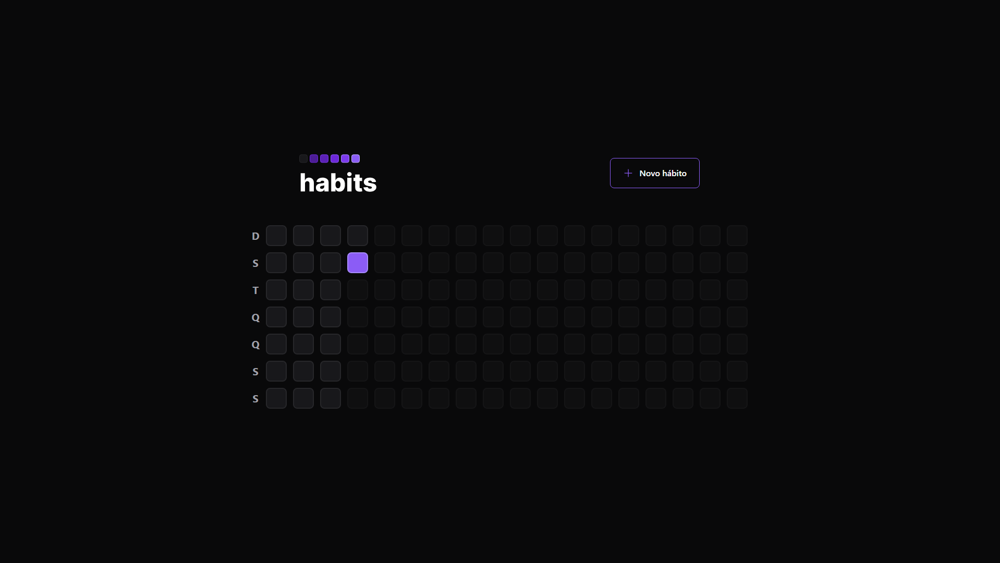
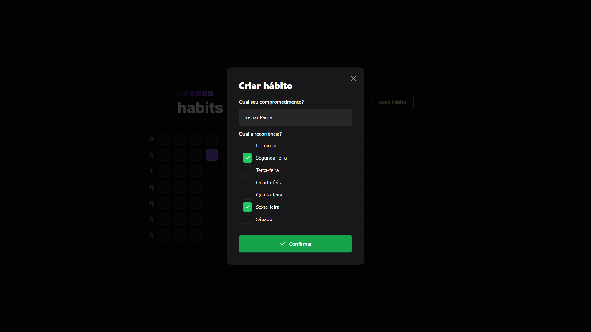
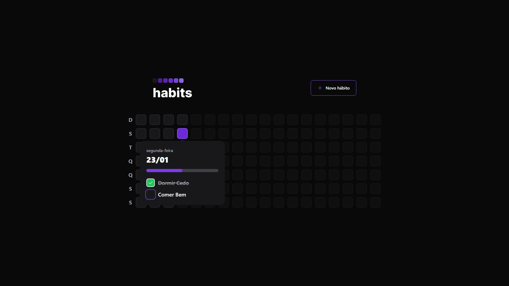
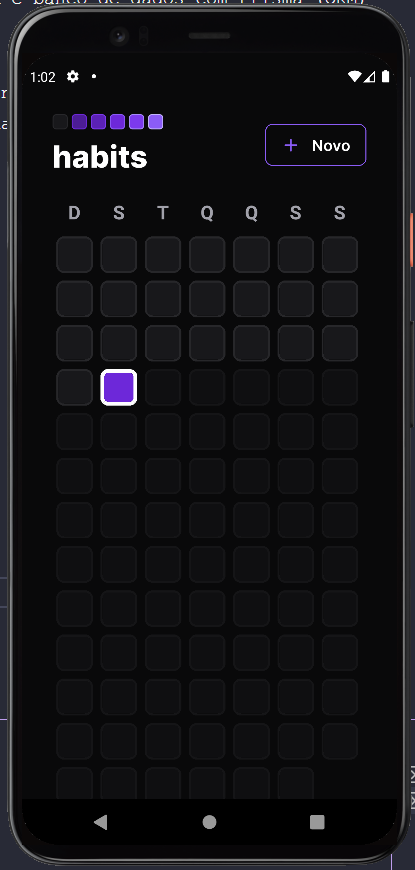
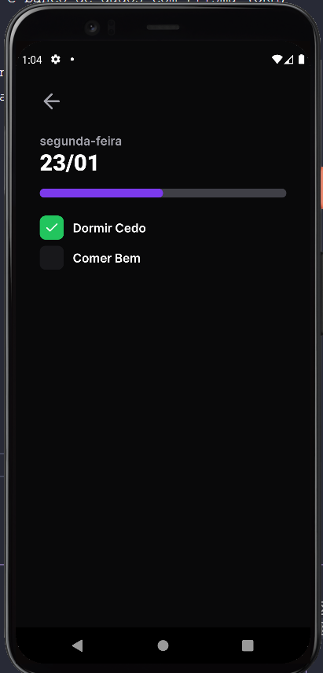
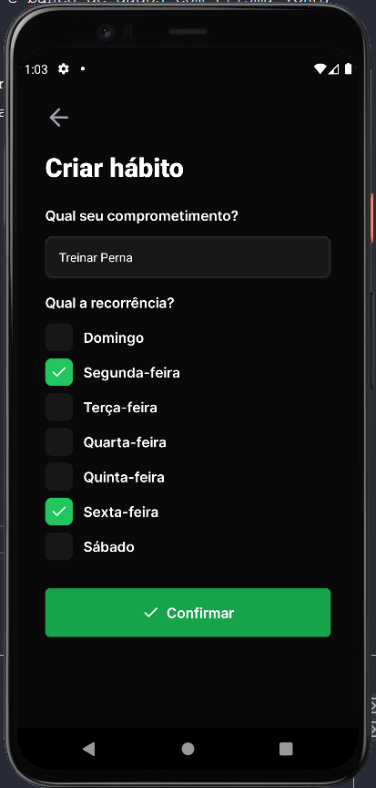

  

  <a href="#-demonstração-do-app">Demonstração do Site</a>
  • <a href="#-demonstração-do-app">Demonstração do App</a>
  • <a href="#-tecnologias">Tecnologias</a>

### 📖 Sobre
Projeto feito em Web e Mobile consumindo a API realizada no backend e banco de dados com Prisma (ORM) com SQLite.

Tem o objetivo de que o usuário cadastre Hábitos, coloque a recorrência e o tipo. Ao longo do ano irá registrando sua produtividade gerando assim um resumo e garantir sua disciplina.

 

### 💻 Demonstração do Site

  
  
  

 

### 📱 Demonstração do App

  
  
  

 

### 👩‍💻 Tecnologias

Abaixo estão as tecnologias e bibliotecas utilizadas neste projeto.

- [Vite - Ferramenta para Ambiente Web](https://www.radix-ui.com)
- [React.js - Front-end](https://reactjs.org)
- [Expo SDK 47 - Aplicativo](https://expo.dev)
- [React Native - Aplicativo](https://reactnative.dev)
- [Typescript - Tipagem](https://www.typescriptlang.org)
- [Node.js - Back-end](https://nodejs.org/en/)
- [Fastify - Back-end Framework](https://www.fastify.io)
- [TailwindCSS - Estilização](https://tailwindcss.com)
- [Prisma (SQLite) - Banco de Dados](https://tailwindcss.com)
- [Radix - Acessibilidade](https://www.radix-ui.com)
